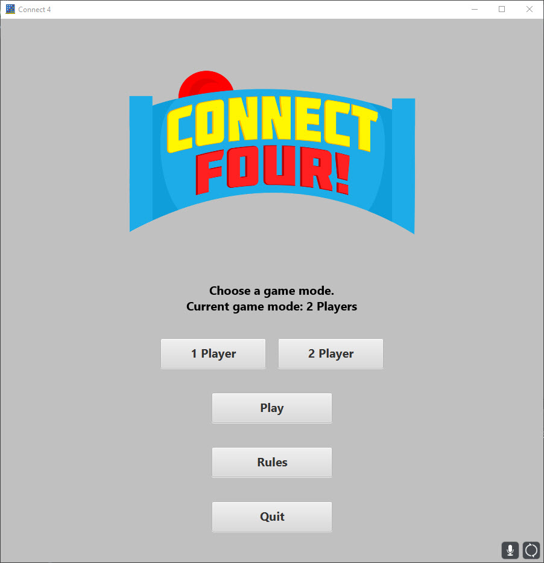
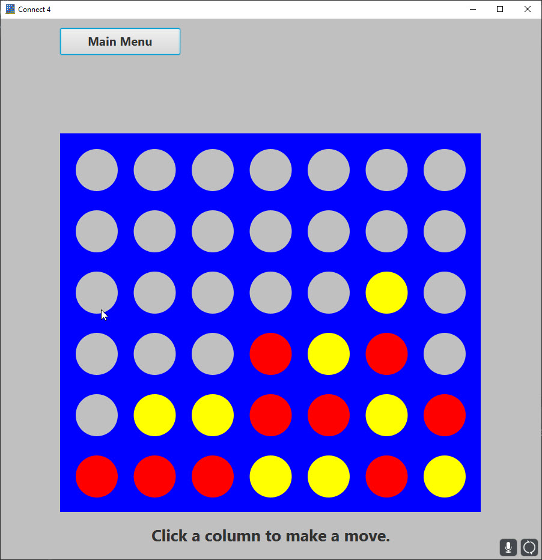
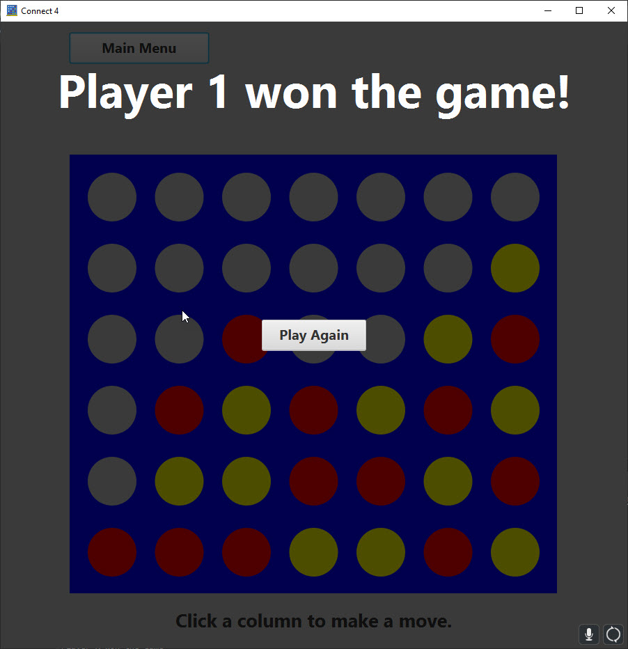

# Connect 4

## Introduction
Classic Connect 4 game where users attempt to connect four of their colored disks by dropping them into the holder before their opponent does.

## Features
- Optional GUI: Users can choose between a terminal or GUI version of the game.
- Game Modes: Users can choose between single or 2 player modes.
- Animations: Disk pieces are animated so that they appear to fall into the user’s chosen columns.

## Getting Started
These instructions will get you a copy of the project that should run on your local machine for development and testing purposes.

### Prerequisites
- Java Development Kit (JDK) version 11 or higher.

### Installation
1. Clone the repo:
2. Open the project in your preferred IDE (Eclipse, IntelliJ, etc.).
3. Build and run Maven project using pom.xml file.

## Usage
- Read rules.
- Choose which game mode you want to play.
- Click Play at the main menu.
- Click the column you want to place a disk piece into.